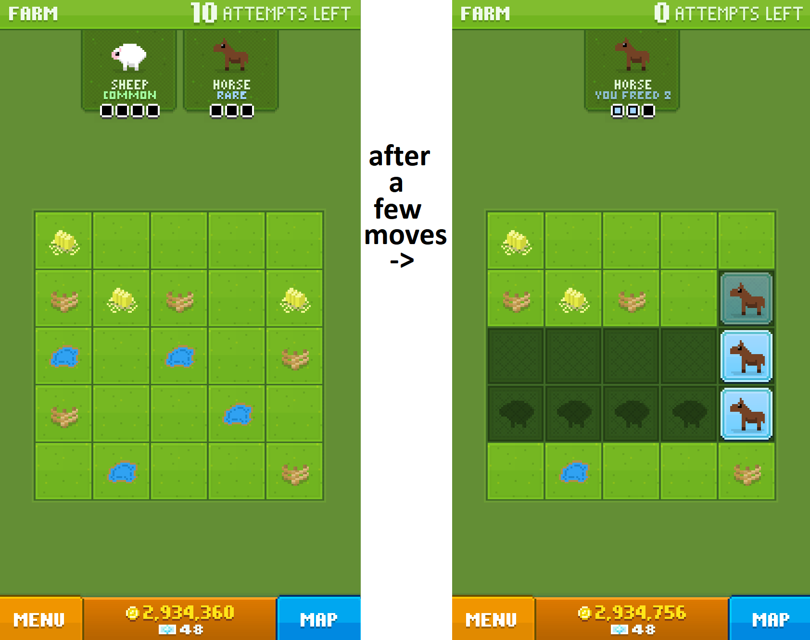

```{r setup, include=FALSE}
knitr::opts_chunk$set(echo = TRUE)
library(reticulate)
```
If you're not familiar with the app Disco Zoo, you're probably in the majority. From the [wikipedia page](https://en.wikipedia.org/wiki/Disco_Zoo), Disco Zoo is a zoo simulation video game developed by Milkbag Games and published by NimbleBit for iOS and Android. It was published into the App Store on 21 February 2014 for iOS. 

In the game, you go on rescue missions to save animals and expand your zoo. On each rescue mission, you are given a 5x5 grid, and between 1 and 3 animals to find. Each animal has an associated pattern, and you have 10 tries to find all the animals. Here is a screenshot from the game to help visualize:

{ width=75% }

I want to build a tool that can guide move making based on all possible sets of arrangements. There's a lot of other functionality that I could build into this as well. For example, it could read in your current zoo population and provide guidance based on which animals you lack or available space requests. There are also other unlockable elements of the game that could be coded in. For the moment being, I'm going to stay simple and just do a version of this code for the base game.
```{python}
import numpy as np
#Dim is the dimension of the grid. Later on it could be fun to change it.
#But for now, the standard grid is 5x5.
dim=5
```
Next I'm going to set a class for the animals. It will contain the patterns dictionary which will hold all of the information regarding the value, pattern, and rescue location of the animals. This will ensure consistency in the class, and leave room for error handling down the line.

It gives each object of class Animal a name, a value, a pattern, and a location. There is also a function called findall which finds all of the possible positions the animal's pattern can take in a grid of the specified dimension.

One cool thing I've spent some time thinking about here is the value option for the animals. Originally I planned on doing a linear 1-2-3 value scheme to indicate the rarity of the animal, and hence how much priority it should recieve.
This makes it difficult when stacking possible outcomes later (if a square takes a value of 2, is it because there is an animal in the square of value 2, or because there are two animals of value 1 occupying the same square (and hence, the grid should not be considered as valid)). 
I've currently (12/30/19) settled on a value scheme of 3-4-5 and will continue to consider other options as I work on this project.

**Thoughts on 1/9/20**
It's probably worth considering switching from value and a binary system of patterns to something that involves character strings. Concatenating instead of summing would allow for determination of feasibility, and a lookup of the character string could be used for identifying the inherent "value" of the possible animal. Worth thinking about at least. 

**1/11/20**
Yeah changed to strings.
```{python}
class Animals:
    def __init__(self, name):
        Patterns = {'sheep' : [1, np.array([['sh', 'sh', 'sh', 'sh']]), 'sh', 'farm'],
            'pig' : [1, np.array([['pi', 'pi'],[ 'pi', 'pi']]),  'pi',  'farm'],
            'rabbit' : [1, np.array([['ra'],[ 'ra'],[ 'ra'],[ 'ra']]), 'ra', 'farm'],
            'horse' : [2, np.array([['ho'],[ 'ho'],[ 'ho']]), 'ho', 'farm'],
            'cow' : [2, np.array([['co', 'co', 'co']]), 'co', 'farm'],
            'unicorn' : [3, np.array([['un','',''],['','un', 'un']]), 'un', 'farm'],
            'kangaroo' : [1, np.array([['ka','','',''],['','ka','',''],['','','ka',''],['','','','ka']]), 'ka', 'outback'],
            'platypus' : [1, np.array([['pl', 'pl',''],['','pl', 'pl']]), 'pl', 'outback'],
            'crocodile' : [1, np.array([['cr', 'cr', 'cr', 'cr']]), 'cr', 'outback'],
            'koala' : [2, np.array([['ko', 'ko'],['', 'ko']]), 'ko', 'outback'],
            'cockatoo' : [2, np.array([['ct',''],['','ct'],['', 'ct']]), 'ct', 'outback'],
            'tiddalik' : [3, np.array([['','ti',''],['ti','','ti']]), 'ti', 'outback'],
            'zebra' : [1, np.array([['','ze',''],['ze','','ze'],['', 'ze','']]),'ze', 'savanna'],
            'hippo' : [1, np.array([['hi','','hi'],['','',''],['hi','','hi']]), 'hi', 'savanna'],
            'giraffe' : [1, np.array([['gi'],[ 'gi'],[ 'gi'],[ 'gi']]), 'gi', 'savanna'],
            'lion' : [2, np.array([['li', 'li', 'li']]), 'li', 'savanna'],
            'elephant' : [2, np.array([['el', 'el'],[ 'el','']]),'el', 'savanna'],
            'gryphon' : [3, np.array([['gr','','gr'],['', 'gr','']]),'gr', 'savanna'],
            'bear' : [1, np.array([['be', 'be'],['', 'be'],['', 'be'],['', 'be']]), 'be', 'northern'],
            'skunk' : [1, np.array([['','sk', 'sk'],[ 'sk', 'sk','']]),'sk' 'northern'],
            'beaver' : [1, np.array([['','','ba'],[ 'ba', 'ba',''],['','','ba']]), 'ba', 'northern'],
            'moose' : [2, np.array([['mo','','mo'],['', 'mo','']]),'mo', 'northern'],
            'fox' : [2, np.array([['fo', 'fo',''],['','','fo']]), 'fo', 'northern'],
            'sasquatch' : [3, np.array([['sa'],[ 'sa']]), 'sa', 'northern'],
            'penguin' : [1, np.array([['','pe',''],['','pe',''],['pe','','pe']]), 'pe', 'polar'],
            'seal' : [1, np.array([['se','','',''],['','se','','se'],['','','se','']]),'se', 'polar'],
            'muskox' : [1, np.array([['mu', 'mu',''],['mu','','mu']]), 'mu', 'polar'],
            'polarbear' : [2, np.array([['pb','','pb'],['','','pb']]), 'pb', 'polar'],
            'walrus' : [2, np.array([['wa','',''],['','wa', 'wa']]), 'wa', 'polar'],
            'yeti' : [3, np.array([['ye'],[''],[ 'ye']]), 'ye', 'polar'],
            'monkey' : [1, np.array([['mk','','mk',''],['','mk','','mk']]), 'mk', 'jungle'],
            'toucan' : [1, np.array([['','to'],[ 'to',''],['','to'],['', 'to']]), 'to', 'jungle'],
            'gorilla' : [1, np.array([['go','','go'],[ 'go','','go']]), 'go', 'jungle'],
            'panda' : [2, np.array([['','','pa'],[ 'pa','',''],['','','pa']]), 'pa', 'jungle'],
            'tiger' : [2, np.array([['ti','','ti', 'ti']]), 'ti', 'jungle'],
            'pheonix' : [3, np.array([['ph','',''],['','',''],['','','ph']]), 'ph', 'jungle'],
            'diplodocus' : [1, np.array([['di','',''],['','di', 'di'],['', 'di','']]),'di', 'jurassic'],
            'stegosaurus' : [1, np.array([['','st', 'st',''],['st','','','st']]), 'st', 'jurassic'],
            'raptor' : [1, np.array([['ra', 'ra',''],['','ra',''],['','','ra']]), 'ra', 'jurassic'],
            'trex' : [2, np.array([['tr',''],['',''],['tr', 'tr']]), 'tr', 'jurassic'],
            'triceratops' : [2, np.array([['tc','',''],['','','tc'],[ 'tc','','']]),'tc', 'jurassic'],
            'dragon' : [3, np.array([['dr','',''],['','','dr']]), 'dr', 'jurassic'],
            'woolyrhino' : [1, np.array([['','','wo',''],['wo','','','wo'],['', 'wo','','']]),'wo', 'iceage'],
            'giantsloth' : [1, np.array([['gs','',''],['','','gs'],[ 'gs','','gs']]), 'gs', 'iceage'],
            'direwolf' : [1, np.array([['','dw','',''],['dw','','','dw'],['', 'dw','','']]),'dw', 'iceage'],
            'sabertooth' : [2, np.array([['st','',''],['','','st'],['', 'st','']]),'st', 'iceage'],
            'mammoth' : [2, np.array([['','ma',''],['ma','',''],['','','ma']]), 'ma', 'iceage'],
            'akhult' : [3, np.array([['','','ak'],[ 'ak','',''],['','','ak']]), 'ak', 'iceage'],
            'raccoon' : [1, np.array([['ra','','ra',''],['ra','','','ra']]), 'ra', 'city'],
            'pigeon' : [1, np.array([['pg','',''],['','pg',''],['','pg', 'pg']]), 'pg', 'city'],
            'rat' : [1, np.array([['rt', 'rt','',''],['','rt','','rt']]), 'rt', 'city'],
            'squirrel' : [2, np.array([['','','sq'],[ 'sq','',''],['','sq','']]),'sq', 'city'],
            'opossum' : [2, np.array([['op','',''],['op','','op']]), 'op', 'city'],
            'sewerturtle' : [3, np.array([['se', 'se']]), 'se', 'city'],
            'goat' : [1, np.array([['go','',''],['go', 'go', 'go']]), 'go', 'mountain'],
            'cougar' : [1, np.array([['co','',''],['','co',''],['co','','co']]), 'co', 'mountain'],
            'elk' : [1, np.array([['ek','','ek'],['', 'ek', 'ek']]), 'ek', 'mountain'],
            'eagle' : [2, np.array([['ea',''],['ea',''],['','ea']]), 'ea' 'mountain'],
            'coyote' : [2, np.array([['cy', 'cy',''],['','','cy']]), 'cy', 'mountain'],
            'aatxe' : [3, np.array([['','','aa'],[ 'aa','','']]),'aa', 'mountain'],
            'moonkey' : [1, np.array([['mk','',''],['mk','','mk'],['','','mk']]), 'mk', 'moon'],
            'lunartick' : [1, np.array([['','lu',''],['','',''],['','lu',''],['lu','','lu']]), 'lu', 'moon'],
            'tribble' : [1, np.array([['','tb',''],['tb', 'tb', 'tb']]), 'tb', 'moon'],
            'moonicorn' : [2, np.array([['mn',''],['mn', 'mn']]), 'mn', 'moon'],
            'lunamoth' : [2, np.array([['lm','','lm'],['','',''],['','lm','']]),'lm', 'moon'],
            'jaderabbit' : [3, np.array([['jr',''],['',''],['','jr']]), 'jr', 'moon'],
            'rock' : [1, np.array([['rk', 'rk'],[ 'rk', 'rk']]), 'rk', 'mars'],
            'marsmot' : [1, np.array([['','ms'],['', 'ms'],[ 'ms', 'ms']]), 'ms', 'mars'],
            'marsmoset' : [1, np.array([['mt','','mt'],['','','mt'],['', 'mt','']]),'mt', 'mars'],
            'rover' : [2, np.array([['','rv',''],['rv','','rv']]), 'rv', 'mars'],
            'martian' : [2, np.array([['mr','','mr'],['', 'mr','']]),'mr', 'mars'],
            'marsmallow' : [3, np.array([['mw'],[''],[ 'mw']]), 'mw', 'mars'],
            'discobucks' : [3, np.array([['db']]), 'db', 'NA']}


        self.name=name
        self.value=Patterns[name][0]
        self.pattern=Patterns[name][1]
        self.abbr=Patterns[name][2]
        self.location=Patterns[name][3]

        
    def findall(self):
        a = self.pattern
        rows = a.shape[0]
        cols = a.shape[1]
        
        rd = dim-rows+1
        cd = dim-cols+1
        ls = []
        
        for i in range(cd):
            if i == 0 :
                precol = np.full((dim, cd-1),'')
            elif i == cd:
                postcol = np.full((dim, cd-1),'')
            else:
                precol = np.full((dim, cd-1-i),'')
                postcol = np.full((dim, i),'')
        
            for j in range(rd) :
                if j == 0:
                    prerow = np.full((rd-1, cols),'')
                    col = np.append(prerow, a, axis = 0)
                elif j == rd:
                    postrow = np.full((rd-1, cols),'')
                    col = np.append(a, postrow, axis=0)
                else:
                    prerow = np.full((rd-1-j, cols),'')
                    postrow = np.full((j, cols),'')
                    col = np.concatenate((prerow, a, postrow), axis=0)
            
                if i == 0:
                    grid = np.append(precol, col, axis=1)
                elif i == cd:
                    grid = np.append(col, postcol, axis=1)
                else:
                    grid = np.concatenate((precol, col, postcol), axis=1)
                ls.append(grid) 
        return(ls)      
```


For a sanity check:


```{python}
animal1 = Animals('unicorn')
print(animal1.name, animal1.value, animal1.pattern, animal1.location)

test=animal1.findall()
print("there are", len(test), "possible locations for a", animal1.name)
print(test[0])
```

Everything is looking good. So now we want to feed in a pair of animals we are given.

```{python}
AnimalList = ['elk', 'goat']

allpat = []
for k in AnimalList:
    allpat.append((k, Animals(k).findall()))
```

```{python}
combined = []
for l in range(len(AnimalList)):
    if len(AnimalList)<= 1:
        print("Too Few Animals")
    elif l == 0:
        for m in range(len(allpat[l][1])):
            for n in range(len(allpat[l+1][1])):
                combined.append(np.core.defchararray.add(allpat[l][1][m],allpat[l+1][1][n]))
```

```{python}
possible = []

for p in range(len(combined)):
    maxls = []
    for q in range(dim):
        maxls.append(len(max(combined[p][q], key=len)))
    if max(maxls)<=2:
        possible.append(combined[p])
```

```{python}
for r in range(len(possible)):
    if r == 0 :
        master = possible[r]
    else:
        master = np.core.defchararray.add(master, possible[r])
```

```{python}
master1 = np.empty((dim,dim))
for s in range(dim):
    for t in range(dim):
        master1[s][t]=len(master[s][t])/2
print(master1)
```

```{python}
x = len(possible)
half = master1 * (1/x)
print(half)
```

1/11/20 - I've just done a pretty major code overhaul, and I'll work on adding some context in the near future. Meantime, I'm thinking a lot about how to proceed from here. 
I've reached a point where I can produce the base probabilities, but that's on the assumption that Disco Zoo is actually randomly assigning where these animals are placed. 
I also haven't figured out the best way to incorporate the values of the animals. Maybe a weighting scheme like expected value? 
If I'm going to try to do expected value, I need to feel more confident in my current value scheme. Is a unicorn really only worth 3 sheep?
